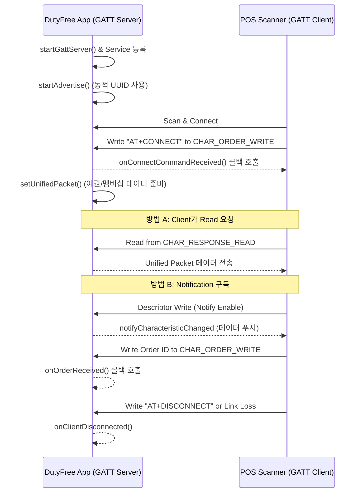

# DutyFree Android App (BLE Advertise)

DutyFree Android App은 사용자 멤버십 정보를 BLE(Bluetooth Low Energy)를 통해 전송하고, 여권 및 출국 정보를 관리하는 안드로이드 애플리케이션입니다. 오프라인 면세점 POS 기기와의 원활한 데이터 연동을 목적으로 개발되었습니다.

## 주요 기능 (Key Features)

### 1. 홈 화면 (Home Screen)
- **그리팅 메시지**: 사용자 이름과 함께 개인화된 환영 메시지 제공.
- **멤버십 카드**: 바코드 형식의 멤버십 번호 표시.
- **여권 정보 카드**: 여권 번호, 영문 이름, 만료일 등 핵심 여권 정보 표시.
- **출국 정보 카드**: 항공사, 편명, 출국 시간 등 출국 관련 실시간 정보 표시.

### 2. MY 설정 (My Tab / Settings)
- **멤버십 정보 설정**: 이름, 멤버십 번호, 등급, 전화번호 설정.
- **여권 정보 입력**: 여권 번호, 영문 성/이름, 만료일 입력.
- **출국 정보 입력**: 항공사 선택, 편명, 출국 시간 입력.
- **데이터 저장**: `SharedPreferences`를 이용한 신속하고 안정적인 데이터 저장 및 동기화.

### 3. BLE 서비스 (BLE Advertising)
- **멤버십 바코드 전송**: BLE Advertise 기술을 사용하여 멤버십 정보를 주변 POS 리더기로 전송.
- **통합 데이터 규격**: 멤버십 정보와 여권/출국 정보를 통합한 전용 패킷 규격 준수.
- **GATT 서버**: POS 기기와의 연결을 위한 전용 GATT 서버 및 특성(Characteristic) 구현.

## 기술 스택 (Tech Stack)
- **Language**: Kotlin
- **UI Architecture**: Fragment-based XML Layout
- **Storage**: SharedPreferences (Synchronous Data Persistence)
- **Connectivity**: Android BLE (Bluetooth Low Energy) API
- **UI Framework**: Google Material Components

## 프로젝트 구조 (Project Structure)
- `com.mcandle.dutyfree.ui.screens`: 각 탭 및 화면별 Fragment 소스 코드.
- `com.mcandle.dutyfree.advertise`: BLE Advertisement 관리 로직.
- `com.mcandle.dutyfree.gatt`: GATT Server 및 전송 데이터 규격 정의.
- `com.mcandle.dutyfree.data`: `PassportStore` (SharedPreferences 기반 데이터 모델).
- `app/src/main/res/layout`: XML 기반 레이아웃 정의 파일.

## 설치 및 실행 방법 (Getting Started)
1. Android Studio를 실행하고 프로젝트를 오픈합니다.
2. `gradle sync`를 완료합니다.
3. 프로젝트를 빌드(`assembleDebug`)하고 실 기기(안드로이드 버전 11 이상 권장)에 설치합니다.
4. **권한**: 앱 실행 시 Bluetooth 및 위치 권한 허용이 필요합니다.

## BLE 통신 시퀀스 및 주요 함수 (BLE Communication)

DutyFree 앱은 GATT Server 역할을 수행하며, 외부 POS 스캐너(GATT Client)와의 통신을 위해 다음과 같은 시퀀스를 따릅니다.

### 1. 통신 시퀀스 다이어그램 (Sequence Diagram)

### 2. 주요 구성 요소 및 함수

#### [GattServiceConfig.kt](file:///d:/mcandle/dutyfree/app/src/main/java/com/mcandle/dutyfree/gatt/GattServiceConfig.kt)
- `SERVICE_UUID`: 기본 서비스 UUID 또는 사용자 정보를 기반으로 생성된 동적 UUID.
- `generateServiceUuid(name, phone)`: 사용자 이름(9바이트)과 전화번호 뒷자리(2바이트)를 조합하여 16바이트 UUID를 생성합니다.
- `CHAR_ORDER_WRITE_UUID`: 스캐너가 명령(AT+CONNECT)이나 주문 정보를 보낼 때 사용하는 특성.
- `CHAR_RESPONSE_READ_UUID`: 스캐너가 데이터를 읽거나 Notification을 받을 때 사용하는 특성.

#### [GattServerManager.kt](file:///d:/mcandle/dutyfree/app/src/main/java/com/mcandle/dutyfree/gatt/GattServerManager.kt)
- `startGattServer(dynamicUuid)`: GATT 서버를 오픈하고 서비스 및 특성(Characteristic)을 등록합니다.
- `setUnifiedPacket(packet)`: 전송할 통합 데이터(멤버십+여권+출국 정보)를 설정합니다.
- `onCharacteristicWriteRequest()`: 스캐너의 Write 요청을 처리합니다.
    - `AT+CONNECT`: 연결 확인 및 데이터 전송 준비.
    - `AT+DISCONNECT`: 연결 종료 요청 처리.
    - `Order ID`: 수신된 주문 정보를 파싱하여 콜백으로 전달.
- `onCharacteristicReadRequest()`: 스캐너의 Read 요청 시 설정된 통합 패킷을 응답으로 전송합니다.
- `onDescriptorWriteRequest()`: 스캐너가 Notification을 구독할 때 데이터를 즉시 푸시(Notify)합니다.

## 개발 정보
- **Source Repository**: [DutyFree Android GitHub](https://github.com/mcandle-dev/dutyfree-android)
- **Design Reference**: Figma Design System
